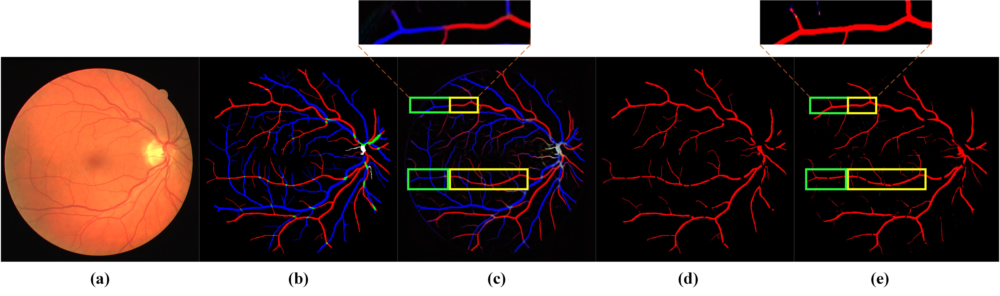
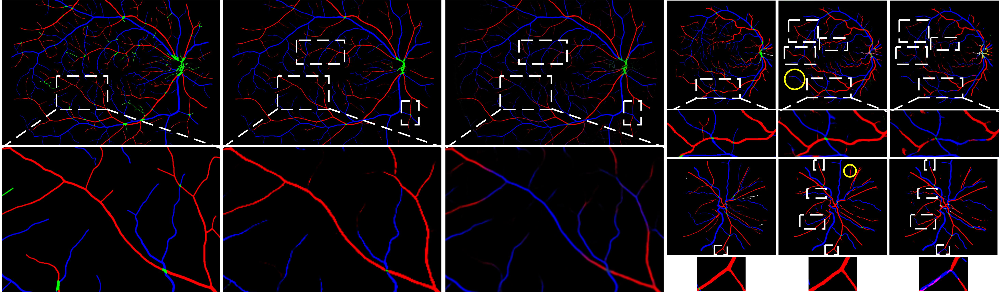

# Learning_AVSegmentation 👀
Code for ["Learning to Address Intra-segment Misclassification in Retinal Imaging"]() 

[](https://github.com/rmaphoh/Learning_AVSegmentation) [](https://github.com/rmaphoh/Learning_AVSegmentation)   ![badge-logo](https://img.shields.io/badge/CMIC-2021-orange.svg?style=flat-square&logo=data:image/jpeg;base64,/9j/4AAQSkZJRgABAQAAAQABAAD/2wCEAAoHCBISEhYSEhUVERIREhESGBIRFRISEBUSGBUcGRgUGhkcIS4mHR4rHxgYJjgmKy8xNTU1GiQ7QDs0Py40NTEBDAwMEA8QGhISHzQnJSE3MTQ0MTE0NDQ0NDQ0PzY/NDQ0NDQ0NDQ0NDQ/NzE0NDQ0NDQ0NDExMT80NDQ0NDE0NP/AABEIAOEA4QMBIgACEQEDEQH/xAAcAAEAAQUBAQAAAAAAAAAAAAAABQEDBAYHAgj/xAA5EAACAQEEBggFBAEFAQAAAAAAAQIDBAURIQYSMUFRYSIyUnFzgbHBEzQ1QnIHM2KhI1OywtHhkf/EABkBAQEBAQEBAAAAAAAAAAAAAAADBAIBBf/EACMRAQEBAAICAgMBAAMAAAAAAAABAgMxESEEMkFRcZFSYaH/2gAMAwEAAhEDEQA/AOzAAAAAAAAAAAAAAAAAtVq0YRcptRS3yaSNLv3TiMU4WVazwf8Akksl3J+51nGtdJ8nJnE86reQc20b/UqE8KdsWpLYqsV0XzklsfcdDs9ohUipwkpxlmpRaaZ5ZZ26zqa6XgAeOgAAAAAAAAAAAAAAAAAAAAAAAAAAACKve/aFljjUljLDKEc5M9kt9R5dTM81KNmtX1pbRoYxp4Vai3Lqp82adfmlle0Yxi/h0+zB4N9739xrjZpx8f8AOmHl+Z+Mf6kr1vuvapY1JPDdCOUF5EbLY+5gS2PuZpkk9Ritt91rDJi4dJbVYpY0pvV3059Km13PZ3oh2DK3fl3HRrTuzWvCE2qNZ4LVl1ZP+LNuXFbz5gTwNt0b06tVkwhNuvR7E3jOK/jLb5E9cf6Wzzf8ndAQdw6TWW2RxpTSlvhPCM15E4SvpeWXoAAegAAAAAAAAAAAAAAAABbqVIxTcmkltbeCQFwxbbbqdGLnUkoJcXm+5Gr35prTp4ws6+JPNa76qfJbzQrfeNWvLXqTc3z2LuRfHBb7vpk5flZz6z7v/jab903lPGFm6EdjqPrtcuBp1WrKbcpNybzbbxbPANWcZzPTDvet3zqgAim3gli3uWbOnAe6VCdRuMIuTwexcicuzRqdTCVV/Dh2fvf/AEbVZ7HTpU3GnFRWrLP7nlvZLXLJ6ntTPFb24jUg4tqSaae88my2ihGeKksc3nvREWm7ZRzh0o8PuRGa8tdz46YIDB05XLPXnCSnCThKLxUovBpnQtGv1KnDCnbV8SGxVYr/ACJfyX3d5zkHlkvbrOrnp9KXfeVG0QU6M4zi+y02uTRmnzZdd717LPXoTlCXLqtcGjqOjP6j0qurTtaVKo8viL9uT/4kdYs6XzzS9+nQgWqVWMoqUWpRaxUotNNd5dOFgAAAAAAAAAAChU5vpbpLX+LOhB/DhCTg9XrSweGOO47xi7viJ8vLOOea2i+tKaFm6KfxanZi8l3s57fGkNe1Ppy1YboRyiv+yIlJt4vNsobMcWcPm8nPvk9X1P0AAoiAyrFYalaWrCLf8vtXmbXdejlOnhKp/knw+xHGtzPbrOLrprt23LVr5pfDh25L0Rt123PSoLorXnvnLN+RIpYZLJLctgM+uS6aM8cyHmr1ZfjL0PR5q9WX4y9CbtzF7X3sqUe197B4uxrTYoVNq1ZdpEPabFOntWtHtI2I8tHs1Y5uZWrgmbVdsZZw6MuH2siq1CUHhJYc9xWWVOyxbAB68T+j+llqsclqS16e+nPFxfdwOsaN6bWW2JRb+DV/05vb3PYzhBWMmmmng1mmsmmc6xK7zyXL6fRU5DoDpjanXp2Wq/iwqS1FKb6cOeO868Q1nw1Y3NTzAAHjoAAAAADjulPzdbxZ+rOxHHdKfm63iT9WaPj/AGrH836T+ocAozW+euUqcptRhFyk9yzNluvRh5Trvn8OPuyU0cs8I0ITjFKU1i5YZvNksZ98t6i+OKd1bo0YU46sIqMVuRcAILABVAUEouSkksejL0MuhYm85dFcN5muCjCSSw6MvQ8uorjit9304xOLTaeWbBnTinjjxZjToNbM1/Z55UuLOlkFQeuQ8TgpLCSTXM9FQIi03W9tPP8Ai/YjZQaeDTT4M2cxLzpxdNtrNYYPed51+K4uYggAUTbBoJ9Ss/iL0Z9Anz9oJ9Ss/iL0Z9AkeTtp4OqAAmsAAAAABx3Sn5ut4k/VnYjjulPzdbxJ+rNHx/tWP5v0n9Q5RlSjNb51dCuD5an+L9WSJHXB8tT/ABfqyRMWvtW3PUADJsEE55rHBYnLrM82R5oWWU+S4skKNnjDYsXxe0vAnb5a8ccyHmr1ZfjL0PR5q9WX4y9DxRySW197AltfewevFudJS7+JjTpOPNcTNB75c3MqOKly0RSllwPB6lZ4DFvH9uXkZRi3j+3LyPZ3HN6a8VKFS6MbBoJ9Ss/iL0Z9Anz9oJ9Ss/iL0Z9AkeTtp4OqAAmsAAAAABx3Sn5ut4k/VnYjjulPzdbxJ+rNHx/tWP5v0n9Q5RlSjNb51dCuD5an+PuyRI64Plqf4+7JExa+1bc9QMq7uu+5mKZV3dd9zOL0px/eJMAE20PNXqy/GXoei3XmlCTbSWrLb3AcmltfewVqRabxWGb2lD14AADFtXW8i0XbV1vItHUQ13Qxbx/bl5GUYt4/ty8j2dxzemvFShUujGwaCfUrP4i9GfQJ8/aCfUrP4i9GfQJHk7aeDqgAJrAAAAAAcd0p+breJP1Z2I47pT83W8SfqzR8f7Vj+b9J/UOUZUozW+dXQrg+Wp/j7skSOuD5an+PuyRMWvtW3PUDKu7rvuZimVd3Xfczi9Kcf3iTGJh2y8IU+s8ZdlbSAtt51KmWOpDsx9zhsTFtvenTyj05cuqiBtVrqVHjOWP8VlFeRYKAW69njNdJee8irTYJQzj0o8tpMgDWwTdpsUJ59WXFe5F2iyThtWK4rYBHWrreRaLlp63kWzqIa7oYt4/ty8jKMW8f25eR7O45vTXipQqXRjYNBPqVn8RejPoE+ftA/qVm8T2Z9AkeTtp4OqAAmsAAAAABx3Sn5ut4k/VnYjjulPzdbxJ+rNHx/tWP5v0n9Q5RlSjNb51dCuD5an+PuyRI24pqNlpttJarzfey3a73wyprF9p7PIxa+1bc9RI168ILGTw9WRVW+ppv4fRTyb+5ojalSUnjJuT5ng5UzPHtIQrqeeOfPaXCLRfp2lrJ5rjvOLF88n7ZpQpConszPR4qoVB5nNR2gei1VqxWTz5GPUtLeSyX9lg6kS1yfpiWyxqb1o9F8NxGVKcoPCSw9CePM4KSwaxXM9S8oExbx/bl5ExaLvwzhn/F7SHvOLVKSeTyyZ7O49vTXioBZFsGgf1KzeJ7M+gT5+0D+pWbxPZn0CR5O2ng6oACawAAAAAHHdKfm63iT9WdiOMaXVlG11sdvxJ5ebNHx+6x/M+uf6jCxWtKWSzf9GNVtEpclwRZNF1+mOY/absV/wA1FQqZ045LD7V3E1RrRqLWg1JcjSi7QrzpvGDcX/T8iOsS+187s9N0BD2G+oywjUWpLtLqsl4yTWKzXFEbLO1ZZelQAePVYya2ZGVTtW6WXMxAHU1Z0yqlp3R/+mNKTebzKAF1b2AAOQFJSSWLyXF7CIt19xj0aa132n1UeyW9PLZO0pXrQgsZtRXPaa5e14xqpwjHCPafWZg1686jxm3J/wBItls4k7S1yW9MKpQa2Zr+y2SJbqUVLk+J1Y8mv2k9A/qVm8T2Z9AnAtB6TjeVn4fE2ruZ30z8vcbODqgAJrAAAAAAQN/aL2a2JucdWpuqQyljz4k8D2Wzp5ZLPFcSv/RC02RuWr8SlunDPLmtzNcaPo2UU1g0mnueaNP0i0Fo2jGdHCjU4JdCXlu7y2eX/ky7+P8AnP8AjkQJK97ktFknq1oOO3CSxcJdzI0szWWeqGVY7fUpPovGPZewxQPHkl8NqsV6U6mXUn2Xv7mZ5oxJWK+J08pdOPPrIlrj/SmeT9tnBj2W2QqLGD8nlJeRkE76VADHtVsp01jN59lZyYnsZBH229adPJdOfZWxd7Ie23vOpio/44cF1n3sjimeP9pa5P0yrXb6lV9J4LsrYYoBVO3yAEnc9xWi1z1aUG+M3ioLvYJLfURiRslwaH2m1NS1fh0ssZzyxX8VvZvWj2g1Cz4TrYVqq4rCEXyW98zcIxSWCWCW5Edcv6acfH/Ov8QlxaM2axpakdae+pNYyx5cCdAI229tUkk8QAB49AAAAAAAAAABj2qy06sHCpFTi1g1JYnP9Iv0821LG+LdKT/2v2OkA6zq56cbxnfb51tVlnSk4VIShJbpJplk77e9yULVHVqwTe6SyknxxOZaRaC17PjUo41qSzy68VzW/wAi+eSa7ZN8Gs+57jTwVlBp4NNNZNPJooUQeozcXjFtPiiZsV+YdGqsf5r3RCA8uZe3U1Z0mrbfbeMaSwXbe3yIec3J4ybbe9nkCZk6Lq3sAPUYNvBJtvcs2z1y8l+yWSpVmoU4SnJ7ops2vR3QStXwqVsaNN4PB9eS5Ld5nTLpuahZY6tGCjxk85N8cSeuSTpfHBrXu+o0rR39PcMJ2t8GqUH/ALn7HQLNZoUoqEIqEVsUVgXwQ1q67a8YzjoABy7AAAAAAAAAAAAAAAAAAAAAGt39ohZrWnLVVOp24JLF80cwv3Re02SXSi5091SCbj/4dzLdSEZJxkk4tYNNYpo7zyXKW+HOv+q+cwdX0g0ApVcZ2ZqlPbqPqN+xzW8rrrWabhVhKDXFZNcUzRnU10x749Y7YQM667prWmahShKb3tLoxXFs6Vo9oFSo4TtOFWpt1fsT9xrcz2Y49b6aNcOitptbxjF04b6k01Hy4nTrh0Ss1kSeqqlT/Umsc+S3E/CCilGKSilgkskkXDPrkuvTZjhzj+gAOFQAAAAAAAAAAAAAAAAAAAAAAAAAAAAAMS3WClXhqVYRnHhJY4c0ZYAxbDYadCChSjGEVuisMebMoAAAAAAAAAAAAAAAAAAAAAAAAAAAAAAAAAAAAAAAAAAAAAAAAAAAAAAAAAAAAP/Z)  ![badge-logo](https://img.shields.io/badge/Moorfield-2021-blue.svg?style=flat-square&logo=data:image/jpeg;base64,/9j/4AAQSkZJRgABAQEAPAA8AAD/2wBDAAIBAQIBAQICAgICAgICAwUDAwMDAwYEBAMFBwYHBwcGBwcICQsJCAgKCAcHCg0KCgsMDAwMBwkODw0MDgsMDAz/2wBDAQICAgMDAwYDAwYMCAcIDAwMDAwMDAwMDAwMDAwMDAwMDAwMDAwMDAwMDAwMDAwMDAwMDAwMDAwMDAwMDAwMDAz/wAARCAA/AEQDASIAAhEBAxEB/8QAHwAAAQUBAQEBAQEAAAAAAAAAAAECAwQFBgcICQoL/8QAtRAAAgEDAwIEAwUFBAQAAAF9AQIDAAQRBRIhMUEGE1FhByJxFDKBkaEII0KxwRVS0fAkM2JyggkKFhcYGRolJicoKSo0NTY3ODk6Q0RFRkdISUpTVFVWV1hZWmNkZWZnaGlqc3R1dnd4eXqDhIWGh4iJipKTlJWWl5iZmqKjpKWmp6ipqrKztLW2t7i5usLDxMXGx8jJytLT1NXW19jZ2uHi4+Tl5ufo6erx8vP09fb3+Pn6/8QAHwEAAwEBAQEBAQEBAQAAAAAAAAECAwQFBgcICQoL/8QAtREAAgECBAQDBAcFBAQAAQJ3AAECAxEEBSExBhJBUQdhcRMiMoEIFEKRobHBCSMzUvAVYnLRChYkNOEl8RcYGRomJygpKjU2Nzg5OkNERUZHSElKU1RVVldYWVpjZGVmZ2hpanN0dXZ3eHl6goOEhYaHiImKkpOUlZaXmJmaoqOkpaanqKmqsrO0tba3uLm6wsPExcbHyMnK0tPU1dbX2Nna4uPk5ebn6Onq8vP09fb3+Pn6/9oADAMBAAIRAxEAPwD9/KKK5f4m/Eaz8HW1vpcWteHNN8WeIo57fw3aavdiFNSvEiLrGFB3yKDgsIwWC5xV06cpy5Y/1/wxFSpGEeaWxo+OPGdr4C8JavrF1Hd3UWjWM2oS21nEZ7qWOJCzCOMcuxwQAOpwK8EP/BQ3TNd8e/AG40Cxg1H4c/HaK8htddeYxz2F9HB50Fs8WCNz7ZkYFsq8ZFfN+r/Fjxz8V/jxpXifRvD8Xg39rX4VW66b4k8CXOoeTpnxG8PvLmQ2M0h2PHuJmik+9E2Vfd8pq98Tfg14b/Y++EPxJ8YeKktvEfwS8O+M9M+IfgfTNB1Urqeia284W6s43X92IBPIWVQ4BDyA4yTX2eG4fw9K1PEPmqS0UVbVy91cutnrKE4SvyyipLdNHx2Kz7EVOapR92nHVyeyUXzO7a00jKE425otxezTN3UP2+/iQ/7P11ef2jp9t4v0v48p8OLp47CMxtYnUAoQIwIy1uyjd97qQc16p4i/4KLx/D7x1+0bea/ptongH4D2mnKt3bOft2qX9xbmaS2AY7M7mhjXod0gzXzb8Rv2tP2ffgprngLxLbaZf/EPw9+0H4+i+ILm/CpH4RuYAlobuOMKG86O42ho2J+7Mc8KD2Wn/CD4Q/Ez9ofx18FR498Q+KfFK+On+MHiiztLGIW98YXhEeiSOThxGfJbapBGAGIIIHp1sswnLz18PKMXd3UXdJTgp7bctpQXNZLmujy6OZ4u/JRxEZyVl8S3cJOG+/NeMvdu3y2Z9t+Cfizpfi2z8PxXEkei+IPEGkx6zHoN9PGmpQQlUL7ogxJ8tnCMVyobjNdRX5o6V4v+KWm/E6+8ZJ4NvR+0z+0CJtO8I6fqtm/2P4W+FraTaJrtypVXyRM8Y5kkaMEfwn7X/Z3/AGi/DPxA13VPh7aeNbfxz42+HdlaW/ifULW08qCS6dCrEsgMKyFkYtEjEx7gCBXy2aZHPDR9pTfMrXdtba2bur+4pe4pN+807XWp9VledRxD9nUVn0vpfS6X+Jx95xS91NX1PV6KKK+fPeCvif8A4KAQ+KfHOparpnxC/Z/g+LnwdilWfR9a8F6j5ninw9KqKHnEDbH8wSBsNbvwFAYHkV9leJtXk8PeG9Qv4bK61KWxtpLhLO1AM90yKWEcYJALsRgZIGSOa/MU+FfC/hf4hDxN4a/Z5/bV+GuoyamNTvU8K3TfZb6Uy+bIskDXMkbJI2QwUDhjjFfU8L0E60q3WO3TXumpwkn2aUl3R8txRieSjGj/ADb9dPRwlFrum4vqnc1/Hf7VfhP9jj9m34N/E7XfDPjP9oC0tdV1CHwz4v8AEttHpGt+FQ2YlsrgyRh3cosqCRxiQxk5HyGvLv2fv2a/h94auPEnxP8AGHxM0uw/Zl/aKilhs/D1+81vqtxfXV4GjjaFQY0lspw5FzGSNq7jhCa9i/bS8NftJ+Iv21NC0TSPiP8ADfVPh/4uuLd7fwd4gfT7cJaM4Mtvd2EwaW6wA2HjLMSBgIRXQ/F34J+Lv2gv2o9R8B+MfhZ8G/EHwCsrmHR/D1pcazbWGt6DGIUSaeyNvmVCzBmMDBCQijK45+zoYqnSw8XGok6ic5OM1fkUrqMYyjGMakZO6ceVaSdr2Pjq+HqVsRKMqbaptQipQ93ncbOUnGUpSpuKs1LmesVtc8ttz8Gfh3YeLvBOt/s+eIp0/ZCtT4n06TWNeVrzWRcXYkeb5AI5YZNonAfKHYF2rgioF+Ab2/w+8Z/G/wDZrPi0/Gb4y2o1q00DXZ7SHWdB0W8vCby8tIi2H8yVUCSuxIjbK/NjP6IQfsm+Bpfh+fDup6QNegn8Np4Su73UpDNf6hpi5xbz3HDuvLHk5yxPUk18RftqWOl/sa/tnQfFW18O/EP4o/EX7NaWHhjQ9C0y6tvD/g7RUXyGE8kCt57H984izgsRlFAVq4csztYyrKjh+bnetpNyjPZuLUpWUZzvOTbVlp717HdmeSPCUo1cQo8i0vFKMobpSTUbuUYWjFJO710tcg+A3j2w8dfAjwx+zT4g/aO1vTfjXrOrzSeLZdHSfWNQnR3lluNKTUdrRwypGFV5UciMxuORXXfB218Y/s06ZoUutXXw3/ZI+BPgy+NwNAuby31DXfFixswdry5dtiCXAYlC8xyMnpXjGseM9C/4J7/8FNtS0f4Rfs1+JfGGu+IHjdNTu9RuS8qXoWaYacGjMMEILEPJIxIKOpZFBFeveL/2BNd+Hfxum1TwN+z94J+I99cRR3reMPib42l1W4guZCzvbpbskmxYSQFZAMjGDxXTjY0U1zPlp1o+0XN7LWT+JpcyjFWaUedVJR15banLgJVnFqK5qlGXs3y+10ircqb5W5O6blyOEX9q+h9+6JrVp4l0Wz1GwuIrux1CBLm2nibck0bqGV1PcEEEfWisP4OL4oT4X6IvjS18P2XilbYLqMGhtI2nQyAkbYTIA+wLjqPWivyurFRm4ro/X8T9TpScoKT6r0/A6K6ha4tZI0kaJnUqHXqhI6j6V+ZDfFbSdG+NEUPh34x/tVftIeMvCWrCSXQfCkaWehi6gkybe9lWGO3EWRsdd7cZBFfp3Xx//wAFDtM8QeErC+v/ABB8Y9I+CXwGtrUPqP8AwjtoY/FOvXkjP5ltFMQQm/5cGBWlYlsgAbq+j4ZrxjWlRkr8+3+WkJTbd7JRcb9WfPcS0JSoxqr7L1/z1lGKStq5KVui1Pjf/gop4A+B/wCyj+0l4O+LvjqD4paz8SvFktv4tu/Ax122caXJG6MBNeFWdIkkXy444yQ3lEKUUV6n8RPA2h/An9tvwR8QPAnwn1TxD8S/2kdQt9T0rXPE8ATSPBAmhR7tFgjO83qwrLM5cqcEhWIDqe5+FWo6l4t+FF5d6l8LfBXh7XD4ae1+CGleL2gv/HmqyWdtIy3F01yTg7jFIE3bowWLHkE/Pj/GL4u/8EhvgLL/AMLfjuviX4w+NWryumh32vzXEWkW0MOy6l+0ruIurg3KoFhIVQoOSeK++w862IhHDRlzVYp0+Rz/AIkXrZJOyjTt715PmcXByZ8BXVLDVJ4iceWlJqfOofA1peTau5VL2jaK5U1NRR+ifhP/AIKDfC/xjp2n3tvrvkWGseMbnwJp15PGVtr7VIA5KLIMgI5RgjtgOdoH3hn5H+IHxx1v9uX9orUPDvhL4v8AxO+B3ijwHdqfGvg2/g8vT47C1mH2m5t9Qt0PllovmUyPtkDAgKOa4HxToP7LHmeLP2chonxV0zT/AADJc/Eyaws9RBQ6hb6Yslxp0EzFpgyRYPOB5ivh+Bmh8RP27Pin+0D+zhpHxL/Zu8D3Fkml6i2lfEjSX02HXtT1rybSFbJrqUx+Zd2z229GZQHVic44avPwGQU6M/a4WEo820qvKox5tYN3Uk+dJrRaSUbSVz0cdxBOtD2WJnGXLq40+Zyly2UrWcWuVtPfWLd4ux2Hh/xt8Yf2t/21db+I3wH/AGkvCeqfDLRLmKW803VLi5gttEs1jAeK40+SNfMjfZIVuFdd3J3qVrY/aQ/ZQ8PT/GrxB4vtP2ZvEvxK8IeJJ/7WTxX4G+JU5u9SklUSTyfYftCLjzGcKImwQox1wL/wk/Z++B37MvxPtbPwJZXvgv4rfGfwDLcaFoni6W6l8I3puUVm0tw4/eMj4JgLFwvQfNg0v2Q/2f47H4+L4X0e0+Jf7LXxQ0fZq+r+HNFmfVfA3iyyjlRZZrQTB4VV8hcAo8e/ADYONZ4qFOTq4ZuEIQSV4uEnHq5OlKMpJNWUlGUVrzJbmUMFKrFU8SlOc5tuzU4qT6RVWMoxundxbjJ6Wl0Puv8AZg8G6R4A/Z88I6VoOka/oGkQ6bHLbaZrkzy6lYLIPNMNwzu7eapchgWbBGM4FFd5RX5VWqupUlUlu23338+p+pUKSpU4047JJdtvLoFYnjT4a+HviO2lHxBoml60dDvk1PT/ALbbJP8AYrpAwSePcDtkUM2GHIya26KmE5RfNF2Zc4RmuWSuj86P2k/gr48+HHxLe7m1dPGP7SXx41C58L+FdWtbKRdJ+HHhxMtczW4biKRLZtzuW3ySyfLkBt2d8TfjT4e+BfgbxlpehfD/AMO+NvD/AOyZHpHh7wZqmvST3VxfeKLto4Zo/vbW8tZULH7ySfdxhcfpOVBIJAyOntXz78Qv+CcvgvxL4H0Lw1oMlx4W0Kw+IEPxD1S1hBujrt4k7TvHK8rFgryFTkHgRqAMDFfZYHiKhPkhjY6K22i31+G1koLkjFXXvzk3dnx+P4erx554OWrvvq9tN7pvnfO27P3YRWiPnn9oDxb8Lv2Wv2lvjP8AGew8GX2ufFfwZ4d0FPFFjPIItHSHUpkglubdsMWmMWA4KgFYh3dzVf4mauP2PNU+Jvgb9nnw3ceEdZ8ETad8XbjTY5Eubbx7pMn7q/s7dGUvbxxrFhVQ/eAC7Q2K9p+N3/BOi7+L2rftH3j+IrNT8cdA03R7GOS2bGjPZwOiu7AneDIyvgAYxXo+l/sg6c/xf+HXxB1HVr9vFngbwvL4YuTa7Y7TWoZkj3idGBYqskZkQBhgsc5ro/tjBQpwc5uo1FJpuTT5YU3GLW1lL2kF25rrZM5llGNnVnyQVNOTaaUU1edRSkmtbyj7Ob78tnu0fLfiX4KRftJfETTrhrLxH8V/2dv2j0j8QWl5FcNJqHwy1sQhku7eUndb27qu3C/6qVNuMEq/2j+z18N9f+Efwf0Xw54m8Y3/AI+1jSYmgk12+to7e5vU3t5fmKnBZU2qWzliu48k1f8AhH8HPDHwF8C23hnwfotn4f0CzkllgsbUERRNJI0jkAk4y7Mfxrpa+dzTN5YmKoQ/hxel0ru10m+0uWyly2UrJu71PossymOGbrT/AIklrZuyvZtLuua7jfWKbSstAooorxT2T//Z)


## Table of Contents

- [Learning_AVSegmentation 👀](#learning_avsegmentation-)
  - [Table of Contents](#table-of-contents)
  - [Brief Background](#brief-background)
  - [Advantages](#advantages)
  - [Install](#install)
    - [Requirements](#requirements)
  - [Usage](#usage)
    - [Train](#train)
    - [Test](#test)
    - [Pretrained Model](#pretrained-model)
  - [Performance](#performance)
  - [To do list](#to-do-list)
  - [Reference](#reference)
  - [Contact](#contact)

&nbsp;

## Brief Background

This repository aims at improving multi-class vessel segmentation performance in retinal fundus photograph by alleviating the intra-segment misclassification around the intersections. The research data sets in experiments include DRIVE-AV [<sup>1,2</sup>](#refer-anchor-1), LES-AV [<sup>3</sup>](#refer-anchor-2), and HRF-AV [<sup>4,5</sup>](#refer-anchor-3).
    


## Advantages

There are a few strengths in this work:

1. We strictly evaluate the method performance in multi-class segmentation manner, instead of only considering the classification accuracy (previous evaluation). Mean value and standard deviation are calculated to show robust performance in test.
2. The GAN-based segmentation backbone is revised based on a SOTA vessel segmentation method [<sup>6</sup>](#refer-anchor-4).
3. The binary-to-multi fusion network avoids directly learning on the ambiguous pixel label brought by intersections, achieving SOTA performance on multi-class vessel segmentation.
4.  The code and algorithm are easily transferred to other medical  or natural linear segmentation fields.

&nbsp;

## Install

### Requirements

1. Both work on Linux and Windows, but Linux is preferred to replicate the reported performance.
2. This project is based on pytorch==1.6.0, torchvision==0.7.0, CUDAToolkit==10.1(10.2 is capable), cuDNN==7.5.0
3. A GPU is essential. In our work, we utilise one Tesla T4 with 15 GB of DRAM. If with weaker GPU, we suggest to change the image size setting in `scripts.utils.py`

If you start with building a virtual enviroment using Conda:
```sh
$ conda create --name LearningAIM --file conda_requirements.txt
```

If you already set up your virtual enviroment and just need some packages installation:
```sh
$ pip install -r requirements.txt
```
&nbsp;
## Usage


### Train

```sh
$ sh train.sh
```
All checkpoints will be saved in a new folder named with dataset name, e.g., `./HRF-AV`. The writer document will be stored in `./runs` for monitoring the training process. 
### Test

```sh
$ sh test.sh
```
The segmentation maps are saved in path `./Final_pre`. The `raw_pre` folder includes the images with the same size of raw images while `small_pre` folder contains resized images.


### Pretrained Model

The pretrained model are provided in [DRIVE](). Download them and place them directly at the project folder. Then run

```sh
$ sh test.sh
```
&nbsp;
## Performance

| Test dataset  | Sensitivity        | ROC |    F1-score|  PR| MSE|
| ------------- | ------------------ |-------------|------------|-----|----|
| DRIVE-AV      | $69.87 \pm 0.11$     |     84.13 $\pm$ 0.05  |    70.03 $\pm$ 0.03        |  71.17 $\pm$ 0.03   |  3.09 $\pm$ 0.01  |
| LES-AV        | 62.94 $\pm$ 0.93  |     81.03 $\pm$ 0.04        |    66.69 $\pm$ 0.47        |  68.71 $\pm$ 0.47   |  2.17 $\pm$ 0.05  |
| HRF-AV        |       67.68 $\pm$ 1.57        |     83.44 $\pm$ 0.75        |       71.7 $\pm$ 0.44     |  73.96 $\pm$ 0.31   |  1.9 $\pm$ 0.01  |

&nbsp;
&nbsp;



## To do list

- [ ] Include more datasets  
- [ ] Attach paper link
- [ ] Share pretrained models 
- [ ] Sort out the compared methods
- [ ] Embed vessel segmentation 
- [ ] Toporlogical feature merging

## Reference 
<div id="refer-anchor-1"></div>

[1] [Staal J, Abràmoff M D, Niemeijer M, et al. Ridge-based vessel segmentation in color images of the retina[J]. IEEE transactions on medical imaging, 2004, 23(4): 501-509.](https://ieeexplore.ieee.org/abstract/document/1282003?casa_token=1MVkiY8kNwwAAAAA:t8d77cuJzNDA_iG88PNOxEXi0u6dT3qdxVwKPGXxDBH519xog-73mUAdAJ1ExQtLflikObEA)

[2] [Hu Q, Abràmoff M D, Garvin M K. Automated separation of binary overlapping trees in low-contrast color retinal images[C]//International conference on medical image computing and computer-assisted intervention. Springer, Berlin, Heidelberg, 2013: 436-443.](https://link.springer.com/chapter/10.1007/978-3-642-40763-5_54)

<div id="refer-anchor-2"></div>

[3] [Orlando J I, Breda J B, Van Keer K, et al. Towards a glaucoma risk index based on simulated hemodynamics from fundus images[C]//International Conference on Medical Image Computing and Computer-Assisted Intervention. Springer, Cham, 2018: 65-73.](https://link.springer.com/chapter/10.1007/978-3-030-00934-2_8)

<div id="refer-anchor-3"></div>

[4] [Budai A, Bock R, Maier A, et al. Robust vessel segmentation in fundus images[J]. International journal of biomedical imaging, 2013, 2013.](https://www.hindawi.com/journals/ijbi/2013/154860/)

[5] [Hemelings R, Elen B, Stalmans I, et al. Artery–vein segmentation in fundus images using a fully convolutional network[J]. Computerized Medical Imaging and Graphics, 2019, 76: 101636.](https://www.sciencedirect.com/science/article/pii/S0895611118306025)

<div id="refer-anchor-4"></div>

[6] [Zhou Y, Chen Z, Shen H, et al. A refined equilibrium generative adversarial network for retinal vessel segmentation[J]. Neurocomputing, 2021, 437: 118-130..](https://www.sciencedirect.com/science/article/abs/pii/S0925231221001004)


## Contact

Any question please contact with yukun.zhou.19[at]ucl.ac.uk or yukun.zhou[at]]nhs.net . 

